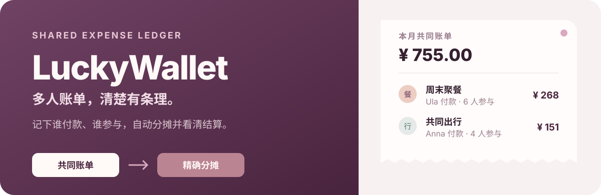

<p align="center">
  
</p>

<p align="center">
  面向家庭、室友、宿舍和固定小团队的自托管共享账本。
  <br>
  从一笔共同消费，到每个人该承担多少，再到最后该给谁，一条线算清楚。
</p>

<p align="center">
  <a href="./docs/guides/how_to_start.md">快速开始</a>
  ·
  <a href="./docs/guides/user-guide.md">使用手册</a>
  ·
  <a href="./docs/reference/api.md">API 文档</a>
  ·
  <a href="./docs/guides/deployment.md">部署指南</a>
</p>

## 产品一览

<p align="center">
  
</p>

LuckyWallet 不只保存金额。每笔账单同时记录付款人、参与成员、分类和消费日期，并把分摊结果持续汇总到成员余额与统计视图中。

### 账单：从记录到分摊

<p align="center">
  
</p>

- 按日期、分类、付款人和关键词筛选账单
- 创建、编辑和删除共同账单
- 按分精确平均分摊，保证各成员份额之和等于账单总额
- 查看付款人、参与人、备注和完整账单明细
- 导出当前筛选范围内的 CSV 数据

### 成员：看清垫付与应承担

<p align="center">
  
</p>

成员视图把历史账单归并为个人垫付、个人支出和净额。结算建议进一步抵消多人往来，尽量用更少的转账完成结算。

### 统计：从月份看到年份

<p align="center">
  
</p>

统计支持月份与年份切换，覆盖支出趋势、分类占比、成员付款和每日变化；全局预算则让团队及时看到本月使用进度。

## 核心能力

| 能力 | 说明 |
| --- | --- |
| 精确分摊 | 后端使用 `Decimal` 与数据库 `DECIMAL(10,2)`，余数按分分配 |
| 结算建议 | 将多笔账单归并为成员净额，生成更简洁的转账路径 |
| 权限管理 | JWT 登录；管理员可管理用户、角色、状态和密码 |
| 数据分析 | 支持月度、年度、分类、成员和每日支出视角 |
| 响应式界面 | 桌面端、窄屏和手机端均提供针对性的布局 |
| 深浅主题 | 统一主题令牌，支持亮色与暗色模式 |
| 自托管 | Docker Compose 一次启动前端、API 与 MySQL |
| 项目 Wiki | VitePress 文档随应用部署在 `/wiki/` |

## 它如何工作

```text
记录账单
  ├─ 金额 / 日期 / 分类
  ├─ 付款人
  └─ 参与成员
        ↓
按分精确计算每个人的承担金额
        ↓
汇总成员垫付、支出、净额与统计
        ↓
生成结算建议
```

一笔账单有且只有一个付款人，可以包含多个参与成员。`bill_participants` 保存每个人的应承担金额，业务层保证所有份额之和严格等于账单总额。

## Docker 快速启动

需要 Docker 与 Docker Compose。

```bash
cp .env.example .env
# 修改 .env 中的数据库密码和 JWT_SECRET
docker compose up -d --build
```

启动完成后：

- 产品首页：`http://localhost/`
- 项目 Wiki：`http://localhost/wiki/`
- 局域网设备：`http://宿主机局域网IP/`

数据库和上传头像分别保存在 Docker volume 中。停止服务但保留数据：

```bash
docker compose down
```

> `docker compose down -v` 会删除数据库与上传文件对应的数据卷，请只在明确需要完全重置时使用。

<details>
<summary><strong>本地开发启动</strong></summary>

先根据[快速启动文档](./docs/guides/how_to_start.md)初始化 MySQL，并配置 `backend/.env`。

```bash
# Terminal 1 · Backend
cd backend
uv sync
uv run uvicorn app.main:app --reload --port 8000

# Terminal 2 · Frontend
cd frontend
npm install
npm run dev

# Terminal 3 · Wiki（可选）
cd docs
npm install
npm run docs:dev -- --port 5174
```

</details>

## 技术架构

```text
Browser
  │
  ├─ /          React 19 + Vite
  ├─ /wiki/     VitePress
  └─ /api/v1    FastAPI
                    │
                    ├─ SQLAlchemy 2
                    ├─ MySQL 8
                    └─ Argon2 + JWT
```

| 层级 | 技术 |
| --- | --- |
| Web | React 19、React Router、Vite |
| API | FastAPI、Pydantic、SQLAlchemy 2 |
| 数据库 | MySQL 8、PyMySQL |
| 安全 | Argon2 密码哈希、JWT |
| 文档 | VitePress |
| 部署 | Docker Compose、Nginx |

## 项目结构

```text
LuckyWallet/
├── frontend/     React 产品界面与 Nginx 配置
├── backend/      FastAPI、业务服务与数据库访问
├── docs/         VitePress Wiki
├── sql/          数据库初始化与演示数据
├── assets/       README 等仓库视觉资源
└── docker-compose.yml
```

## 质量检查

```bash
cd frontend
npm test
npm run build

cd ../backend
uv run pytest

cd ../docs
npm run docs:build
```

项目包含账单、分摊、成员统计、权限、预算、响应式界面和 API 相关测试。提交和分支约定见[协作规范](./docs/collaboration/commit-conventions.md)。

## 文档

- [快速启动](./docs/guides/how_to_start.md)
- [使用手册](./docs/guides/user-guide.md)
- [部署指南](./docs/guides/deployment.md)
- [开发指南](./docs/development/guide.md)
- [实现细节](./docs/development/implementation.md)
- [API 接口](./docs/reference/api.md)
- [数据库结构](./docs/reference/DATABASE.md)
