# LuckyWallet 使用手册

LuckyWallet 是一个面向家庭、宿舍和小团队的共同记账工具。它不仅记录消费金额，还会记录**谁先付款、谁参与消费、每个人应承担多少**，从而生成清晰的收支统计和结算方案。

## 功能概览

| 模块 | 主要功能 |
| --- | --- |
| 总览 | 查看月度共同支出、待结算金额、账单数、预算进度和最近账单 |
| 账单 | 搜索、筛选、新增、查看、编辑和删除共同账单 |
| 成员 | 查看成员的垫付、应付、净额和参与账单 |
| 统计 | 查看趋势、分类占比、成员垫付排行，并导出 CSV |
| 个人中心 | 查看个人收支、修改头像和昵称 |
| 用户管理 | 管理员创建、筛选、启用或停用用户并调整角色 |

## 登录

打开 LuckyWallet，在登录页输入管理员分配的用户名和密码。点击密码输入框右侧的眼睛图标可以显示或隐藏密码。

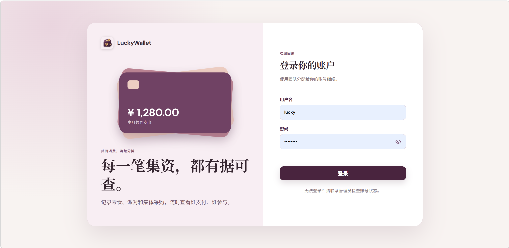

本地演示数据包含以下账号：

| 用户名 | 密码 | 角色 |
| --- | --- | --- |
| `MakiWinster` | `maki1234` | 管理员 |
| `Ula` | `ula12345` | 普通用户 |
| `Anna` | `anna1234` | 普通用户 |

::: warning 演示账号
示例密码仅用于本地开发。部署到公开环境前，请修改密码或停用示例账号。
:::

如果登录失败，请检查用户名和密码，并确认后端及数据库已经启动。被管理员停用的账号无法登录。

## 总览

登录后默认进入总览。左侧导航用于切换功能模块，顶部的“记一笔”按钮可随时新增账单。

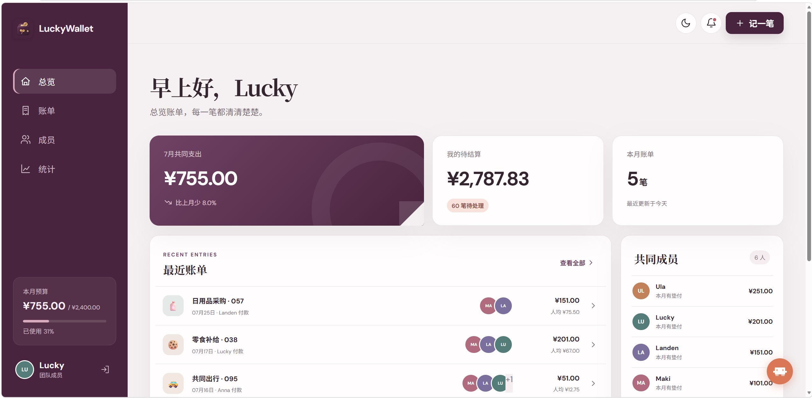

总览集中展示：

- **本月共同支出**：所选月份全部共同账单的金额合计；
- **我的待结算**：根据个人垫付和分摊计算出的待处理金额；
- **本月账单**：当前月份包含的账单数量；
- **本月预算**：共同支出相对家庭月预算的使用进度；
- **最近账单**：最近记录的账单、付款人、参与成员和人均金额；
- **共同成员**：各成员在当前月份的垫付情况。

点击“查看全部”可进入账单列表。点击“查看结算方案”，系统会根据所有账单的净额生成建议转账方案；它只提供结算依据，不会自动发起银行或支付平台转账。

### 设置预算

管理员可以点击左侧的本月预算区域修改预算。预算必须大于 `0`，保存后会应用到所有成员看到的总览中。普通用户可以查看预算，但不能修改。

## 账单管理

### 查找账单

进入“账单”页面后，可以按关键词、日期和分类筛选账单。关键词支持匹配账单标题、分类或付款人；页面会同步显示筛选结果数量和金额合计。

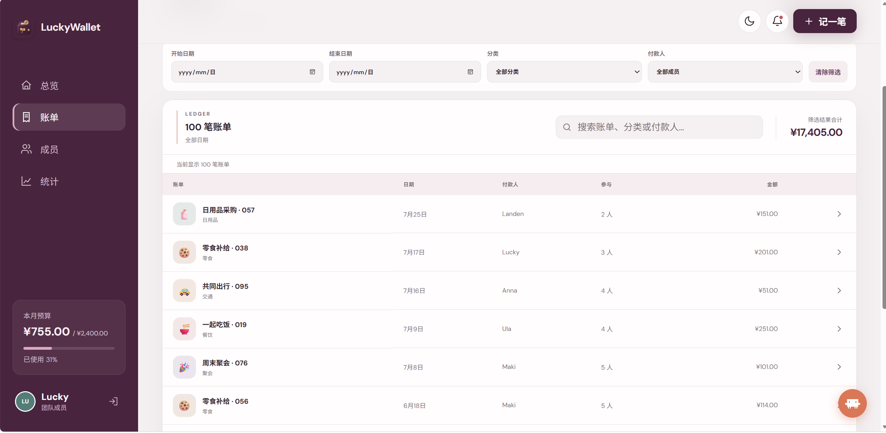

开始日期不能晚于结束日期。没有匹配结果时，可以清除搜索词或重置筛选条件。

### 新增账单

点击页面右上角的“记一笔”，填写以下信息：

1. 输入账单标题和总金额；
2. 选择实际付款人、消费日期和分类；
3. 选择参与本次消费的成员；
4. 根据需要填写备注；
5. 核对分摊预览后保存。

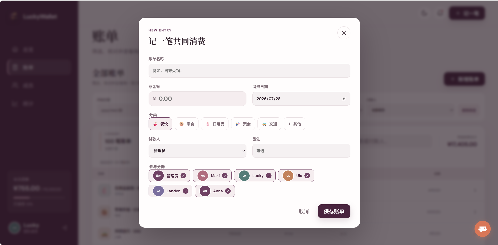

系统按参与人数平均分摊，并处理无法整除的一分钱尾差，保证所有成员的分摊金额之和始终等于账单总额。付款人也可以是参与成员。

### 查看、编辑与删除

点击账单列表中的任意账单即可打开详情。详情页会显示付款人、日期、分类、备注、参与成员以及每人的分摊状态。

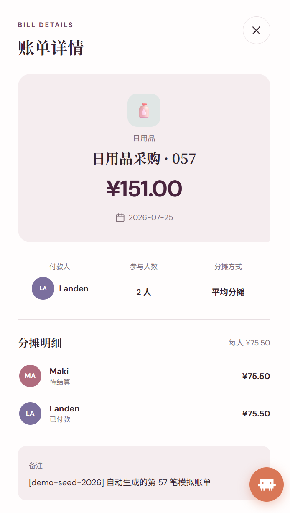

通过详情页底部的操作按钮可以编辑或删除账单。编辑后系统会按照新的金额和参与成员重新计算分摊；删除操作不可撤销，提交前请确认账单信息。

## 成员

“成员”页面汇总每位成员在当前账期的财务情况，包括参与账单数、已垫付、应承担金额和最终净额。

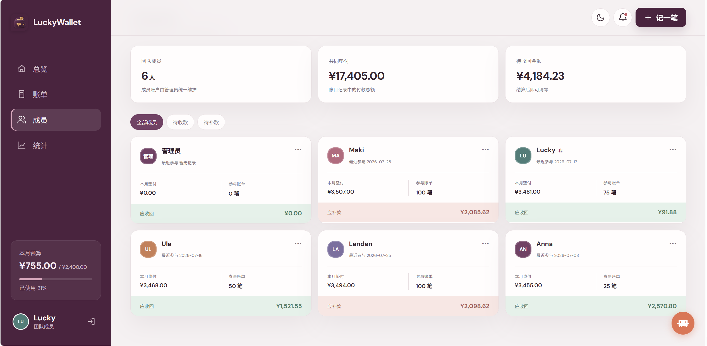

净额用于理解结算方向：

- 净额为正，表示该成员垫付多于应承担金额，应收回款项；
- 净额为负，表示该成员应承担多于已垫付金额，需要支付款项；
- 净额为零，表示当前无需与其他成员结算。

## 统计分析

进入“统计”页面，可以选择不同时间范围，查看共同消费在时间、分类和成员维度上的变化。

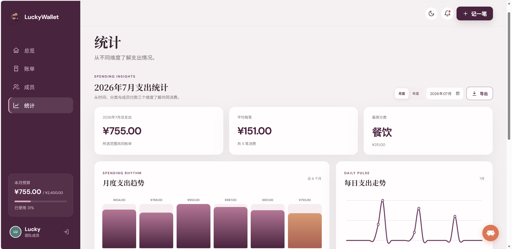

页面提供月度支出趋势、日均支出、最高单笔消费等摘要，帮助快速发现支出变化。

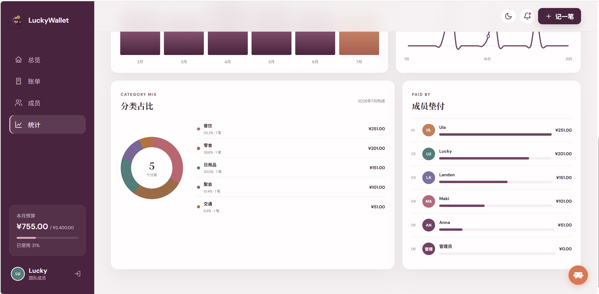

下方的分类占比展示各类消费的金额、比例和笔数；成员垫付排行展示每位成员先行支付的金额。点击“导出”可选择数据范围并下载 CSV 文件，导出汇总会按所选账单范围重新计算。

## 个人中心

点击左下角的个人头像或姓名可打开个人中心。这里展示账号身份、头像以及个人财务摘要。

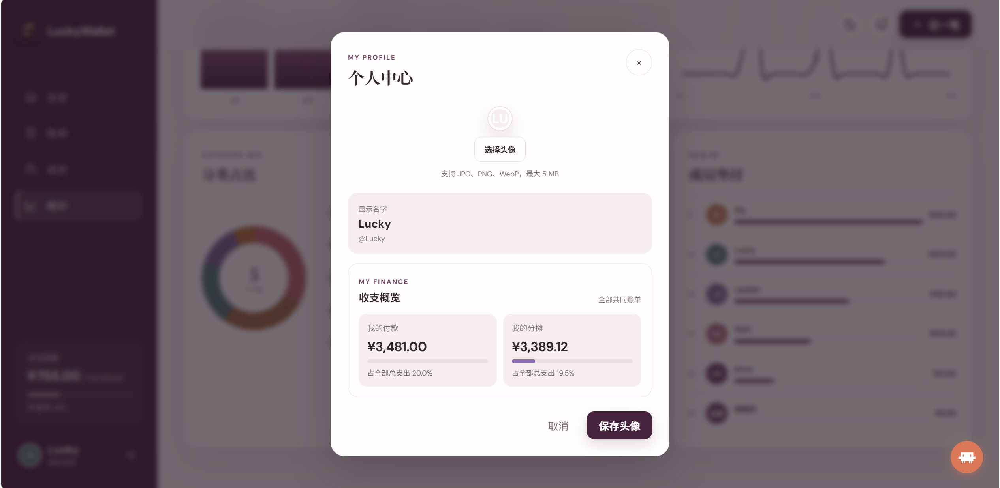

用户可以上传 `JPEG`、`PNG` 或 `WebP` 格式的头像，文件大小不能超过 5 MB。昵称修改成功后会同步到成员、账单和统计页面。

### 个人收支详情

个人中心会区分“我已垫付”和“我应承担”两种金额，并给出当前净额及相关账单明细。

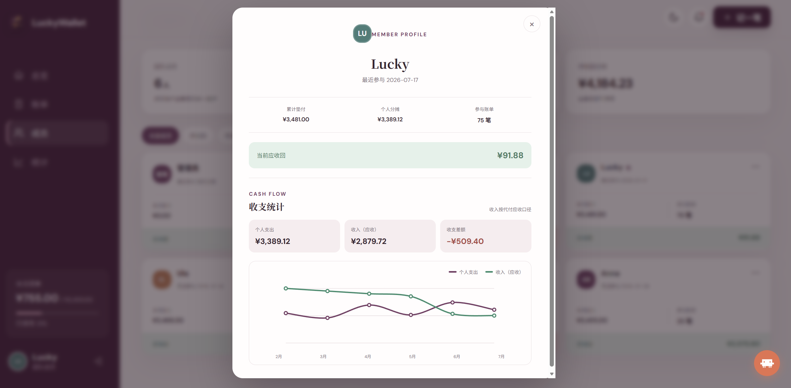

计算关系如下：

```text
个人净额 = 已垫付金额 - 应承担金额
```

账单中的“付款人”是实际先支付整笔金额的人，“参与人”是需要共同承担这笔消费的人，两者不要混淆。

## 深色模式

点击页面右上角的月亮图标可切换深色模式；切换后，各功能页面和弹窗都会采用对应的深色配色。再次点击太阳图标即可恢复浅色模式。

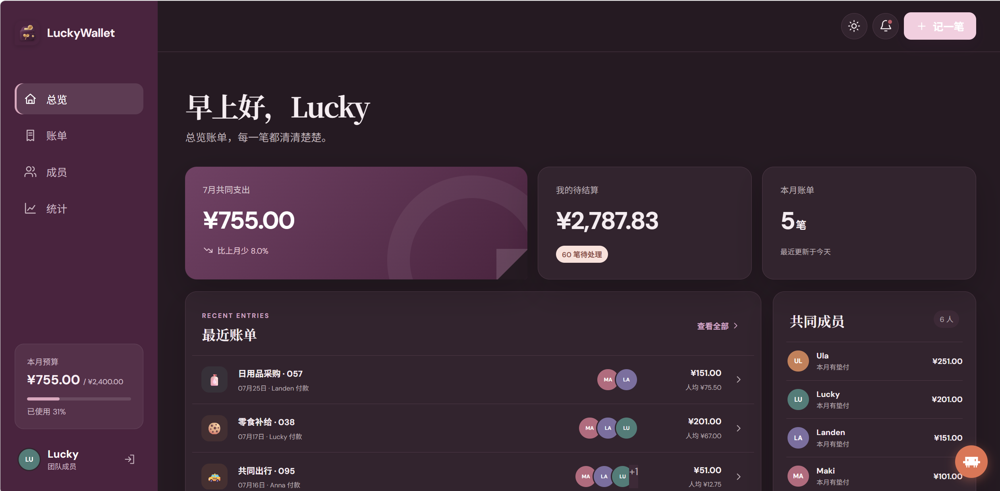

## 权限说明

| 操作 | 普通用户 | 管理员 |
| --- | :---: | :---: |
| 查看总览、账单、成员和统计 | 支持 | 支持 |
| 新增、编辑和删除账单 | 支持 | 支持 |
| 查看结算方案与导出统计 | 支持 | 支持 |
| 修改自己的头像和昵称 | 支持 | 支持 |
| 修改家庭月预算 | 不支持 | 支持 |
| 创建、停用用户和调整角色 | 不支持 | 支持 |

管理员不能停用自己、撤销自己的管理员身份，也不能移除系统中最后一个启用的管理员，以免系统失去可管理账号。

## 常见问题

### 页面无法加载数据

确认后端服务和数据库正常运行。本地开发时，后端默认地址为 `http://127.0.0.1:8000`，可以访问 `http://127.0.0.1:8000/health` 检查服务状态。

### 登录一段时间后返回登录页

登录令牌默认有效期为 30 分钟。令牌过期后需要重新登录，具体时长可由后端环境变量 `ACCESS_TOKEN_EXPIRE_MINUTES` 调整。

### 统计金额与录入日期不一致

账单按“消费日期”归入对应月份，而不是按创建账单的时间归类。请检查账单填写的日期和统计页面选择的时间范围。

### 如何彻底重置本地演示数据

在项目根目录执行：

```bash
mysql -u root -p luckywallet_dev < sql/004_reset_database.sql
```

::: danger 数据删除
重置脚本会删除现有账单、用户和日志，仅适用于本地开发环境，请勿在生产数据库执行。
:::
